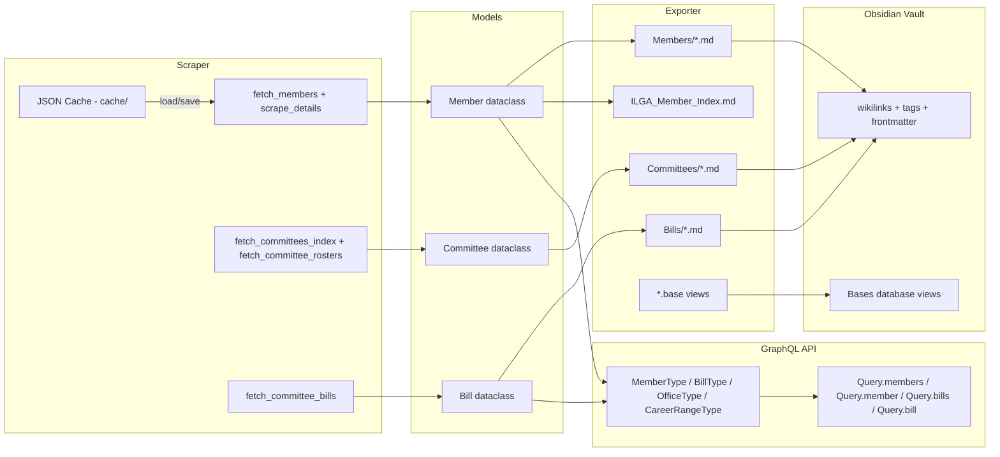

# ILGA Graph POC

A proof-of-concept that scrapes the [Illinois General Assembly](https://www.ilga.gov/) website, models legislative data (members, committees, bills), exports it as an interlinked [Obsidian](https://obsidian.md/) vault with database views, and serves it through a GraphQL API.

## Architecture Overview



## Data Flow

1. **Startup** -- The FastAPI app boots and `run_etl()` fires during the lifespan hook.
2. **Scrape** -- `ILGAScraper` hits `ilga.gov` to pull member listings, detail pages, committee indices, committee rosters, and committee bill assignments. Requests are parallelized with `ThreadPoolExecutor`. Results are cached as JSON in `cache/` so repeat runs skip the network.
3. **Model** -- Raw HTML is parsed (BeautifulSoup) into Python dataclasses: `Member`, `Committee`, `Bill`, `Office`, `CareerRange`, and `CommitteeMemberRole`.
4. **Export** -- `ObsidianExporter` writes each member, committee, and bill as a Markdown file inside `ILGA_Graph_Vault/`. Files use Obsidian `[[wikilinks]]` so members link to their committees and bills, committees link to their members and bills, and bills link to their sponsors. Frontmatter tags power Obsidian's graph view. The exporter also generates `.base` database view files for sortable/filterable tables.
5. **Serve** -- The same in-memory data is exposed through a Strawberry GraphQL API at `/graphql`, supporting queries for members and bills with sorting and date-range filtering.

## Project Structure

```
ilga_graph_poc/
├── src/ilga_graph/
│   ├── __init__.py
│   ├── main.py          # FastAPI app, ETL orchestration, GraphQL endpoint
│   ├── scraper.py        # ILGAScraper — web scraping + caching
│   ├── models.py         # Dataclass domain models
│   ├── schema.py         # Strawberry GraphQL types + sort/filter enums
│   ├── vote_timeline.py  # Bill vote timeline computation (extracted from main)
│   └── exporter.py       # ObsidianExporter — Markdown vault + Bases generator
├── scripts/              # CLI utilities
│   ├── generate_seed.py  # Generate mocks/dev/ from cache/
│   └── scrape.py         # Standalone scrape without starting the server
├── mocks/                # Mock data by type (committed)
│   └── dev/              # Dev sandbox (instant startup, no scraping)
│       ├── members.json  # 20 members (metadata + bill_ids + committee codes)
│       ├── bills.json   # 100 most recent bills
│       ├── committees.json
│       └── vote_events.json
├── tests/                # pytest test suite
│   ├── conftest.py       # Shared fixtures
│   ├── test_models.py    # Dataclass construction tests
│   ├── test_exporter.py  # Rendering and frontmatter tests
│   └── test_main.py      # Date parsing and helper tests
├── ILGA_Graph_Vault/     # Generated Obsidian vault (output)
│   ├── Members/          # One .md file per legislator
│   ├── Committees/       # One .md file per committee
│   ├── Bills/            # One .md file per bill
│   ├── Bills by Date.base    # Bases view: bills sorted/grouped by date
│   └── Members by Career.base # Bases view: members sorted by career start
├── cache/                # Full scraped cache (auto-created, git-ignored)
│   ├── members.json      # All members (metadata + bill_ids)
│   ├── bills.json        # All unique bills (deduplicated by leg_id)
│   ├── committees.json   # All committees (flat list)
│   ├── committee_rosters.json  # Committee member roles (production only)
│   ├── committee_bills.json    # Committee bill assignments (production only)
│   └── vote_events.json  # Cached roll-call vote data
├── .startup_timings.csv  # Startup performance log (auto-created, git-ignored)
├── Makefile              # Dev workflow commands
├── PERFORMANCE.md        # Performance notes and bottleneck analysis
├── TODOS.md              # Project roadmap and completed items
├── pyproject.toml
└── README.md
```

## Module Breakdown

### `models.py`

Plain Python dataclasses that form the domain model:

| Class                 | Purpose                                                |
|-----------------------|--------------------------------------------------------|
| `Member`              | A legislator -- name, party, district, bio, offices, bills, committees |
| `Committee`           | A legislative committee with code, name, and optional parent |
| `Bill`                | A piece of legislation with sponsor, status, and action date |
| `Office`              | A contact office (Springfield or district) with address/phone/fax |
| `CareerRange`         | A year-range entry in a member's career timeline       |
| `CommitteeMemberRole` | Represents a member's role on a specific committee roster |

### `scraper.py`

`ILGAScraper` handles all interaction with ilga.gov:

- **Member scraping** -- Fetches the member listing page, extracts profile URLs, then scrapes each detail page in parallel. Extracts name, party, district, bio, career timeline, committees, associated members, offices, and email.
- **Committee scraping** -- Fetches the committee index table, each committee's member roster, and committee bill assignments.
- **Normalized caching** -- Stores members and bills in separate JSON files (`cache/members.json` + `cache/bills.json`), with members referencing bills by `leg_id` instead of embedding full objects. This reduces cache size by ~70% (from ~12.7 MB to ~3.5 MB). On load, bill relationships are hydrated in memory.
- **Name map** -- Maintains a normalized name-to-ID mapping to resolve wikilink references across the vault.

### `exporter.py`

`ObsidianExporter` turns domain models into an interlinked Obsidian vault:

- Generates **YAML frontmatter** for each note, including sortable properties like `last_action_date_iso` (ISO date) on bills and `career_start_year` (integer) on members.
- Renders **`[[wikilinks]]`** between members, committees, and bills so Obsidian's graph view shows the network.
- Creates hierarchical **tags** (`#committee/agriculture`, `#subcommittee/executive/firearms`) for filtering.
- Builds a **Member Index** page listing all legislators with links to their ILGA pages.
- Generates **Obsidian Bases** `.base` files for sortable, filterable database views of bills and members.
- **Legislative scorecard** — Each member note includes a scorecard that separates substantive bills (HB/SB) from ceremonial resolutions (HR/SR/HJR/SJR), and computes *law heat*, *law success rate*, *magnet score* (avg co-sponsors per law), and *bridge score* (% of laws with cross-party co-sponsorship). A **Scorecard Guide** in the vault explains each metric and how to interpret the numbers; see `ILGA_Graph_Vault/Scorecard Guide.md`.
- Cleans up stale `.md` files on re-export so the vault stays in sync.

### `schema.py`

Strawberry GraphQL type definitions and enums:

| Type / Enum            | Purpose                                                  |
|------------------------|----------------------------------------------------------|
| `BillType`             | GraphQL type mirroring the `Bill` dataclass              |
| `MemberType`           | GraphQL type mirroring the `Member` dataclass (includes scorecard + moneyball) |
| `OfficeType`           | GraphQL type for contact offices                         |
| `CareerRangeType`      | GraphQL type for career timeline entries                 |
| `ScorecardType`        | GraphQL type for legislative scorecard metrics           |
| `MoneyballProfileType` | GraphQL type for Moneyball analytics profile             |
| `VoteEventType`        | GraphQL type for roll-call vote events                   |
| `BillVoteTimelineType` | Full vote lifecycle analytics for a bill in one chamber  |
| `BillSortField`        | Enum: `LAST_ACTION_DATE`, `BILL_NUMBER`                  |
| `MemberSortField`      | Enum: `CAREER_START`, `NAME` -- base member sorts        |
| `LeaderboardSortField` | Enum: `MONEYBALL_SCORE`, `EFFECTIVENESS_SCORE`, `PIPELINE_DEPTH`, etc. -- analytics sorts |
| `SortOrder`            | Enum: `ASC`, `DESC`                                      |

### `main.py`

Ties everything together:

- **ETL** -- `run_etl()` calls the scraper, then the exporter.
- **AppState** -- Holds the in-memory member/bill lists and lookup dicts populated at startup.
- **FastAPI** -- Mounts a Strawberry `GraphQLRouter` at `/graphql` with eight queries:

| Query | Parameters | Description |
|-------|-----------|-------------|
| `member(name)` | `name` (required) | Look up a single member by exact name |
| `members(sortBy, sortOrder, chamber)` | `sortBy`: `CAREER_START` or `NAME`; `sortOrder`: `ASC` or `DESC`; `chamber`: optional filter | List all members with optional sorting |
| `moneyballLeaderboard(chamber, excludeLeadership, limit, sortBy, sortOrder)` | `chamber`: optional; `excludeLeadership`: bool; `limit`: int (default 25); `sortBy`: `LeaderboardSortField`; `sortOrder`: `ASC` or `DESC` | Ranked list by Moneyball Score or any analytics metric. Use `chamber="House", excludeLeadership=true, limit=1` to get the MVP. |
| `bill(number)` | `number` (required, e.g. `"SB1527"`) | Look up a single bill by number |
| `bills(sortBy, sortOrder, dateFrom, dateTo)` | `sortBy`: `LAST_ACTION_DATE` or `BILL_NUMBER`; `sortOrder`: `ASC` or `DESC`; `dateFrom`/`dateTo`: ISO date strings (`YYYY-MM-DD`) | List bills with optional sorting and date-range filtering |
| `votes(billNumber)` | `billNumber` (required) | All vote events for a specific bill (floor + committee) |
| `billVoteTimeline(billNumber, chamber)` | `billNumber` and `chamber` (both required) | Full vote timeline tracking every member's journey across committee and floor events |
| `allVoteEvents(voteType, chamber)` | Both optional filters | All scraped vote events, optionally filtered by type and chamber |
| `metricsGlossary` | *(none)* | Definitions of every metric (empirical and derived) so UIs can show "what does this mean?" |

### Metrics: empirical vs derived

We show **empirical** stats first (directly from bill/member data): laws filed, laws passed, passage rate, vetoed, stuck, cross-party co-sponsorship %, pipeline depth (0–6), etc. **Derived** metrics are explained so they are not a black box:

- **Moneyball score** — A 0–100 composite used to rank legislators (e.g. for Power Broker). It combines passage rate, pipeline depth, co-sponsor pull, cross-party rate, network centrality, and institutional role. Exact weights and one-sentence definitions for each component are in `metrics_definitions.py` and exposed via the GraphQL query `metricsGlossary`.
- **Effectiveness** — We prefer showing *laws passed* and *passage rate* separately; the legacy "effectiveness score" (volume × rate) is documented in the glossary for transparency.

The advocacy UI shows "Laws passed (X of Y — Z% passage)" and "Cross-party co-sponsorship %" before the Moneyball composite, with a tooltip that explains the composite. Use `metricsGlossary` in your client to build tooltips or a "How is this calculated?" panel.

## Obsidian Vault Features

### Frontmatter Properties

Each note type includes structured YAML frontmatter enabling Obsidian search, Bases views, and graph filtering:

**Bills** -- `leg_id`, `bill_number`, `chamber`, `status`, `last_action_date`, `last_action_date_iso` (YYYY-MM-DD for sorting), `tags`

**Members** -- `chamber`, `party`, `role`, `career_timeline`, `career_start_year` (integer for sorting), `district`, `member_url`, `tags`

**Committees** -- `code`, `parent_code`, `tags`

### Bases Database Views

The vault includes two Obsidian Bases (`.base`) files, generated by the exporter:

- **Bills by Date** -- Two table views: "Bills by Date" (all bills grouped by date, newest first) and "Recent Bills" (filtered to 2025+).
- **Members by Career** -- Table view of all members grouped by career start year (earliest first), with chamber, party, role, and name columns.

These views are interactive in Obsidian -- click column headers to re-sort, use the Bases UI to adjust filters.

### Graph View

The graph is configured with color groups:
- **Red** -- Republicans (`tag:#party/republican`)
- **Blue** -- Democrats (`tag:#party/democrat`)

## Getting Started

### Prerequisites

- Python 3.10+

### Install

```bash
make install        # pip install -e ".[dev]"
```

Or manually:

```bash
pip install -e ".[dev]"
```

### Pipeline: scrape → serve

Data is scraped once into `cache/`; the API then **serves only from cache** (no scraping on startup).

| Step | Command | What it does |
|------|---------|--------------|
| **Scrape (choose size)** | `make scrape` | Prod-style: all members, 300 SB + 300 HB. |
| | `make scrape-200` | Test pagination: 200 SB + 200 HB (2 range pages per type). |
| | `make scrape-full` | Full index: all ~9600+ bills (slow; many range pages + detail fetches). |
| | `make scrape-dev` | Light: 20 members/chamber, 100 SB + 100 HB, fast. |
| **Serve** | `make dev` | Start API in dev mode (cache load; dev export cap keeps startup lighter). |
| | `make dev-full` | Start API from full cache in dev shell (no dev caps, no seed fallback). |
| | `make run` | Start API in prod mode (cache only). |

**Typical flows:**

- **Quick dev:** `make scrape-dev` then `make dev` — small cache, fast iteration.
- **See pagination:** `make scrape-200` then `make dev` — 200 SB + 200 HB from index (2 range pages per type).
- **Full dev / prod:** `make scrape` then `make dev-full` or `make run` — full cached dataset.
- **Complete data:** `make scrape-full` (takes a long time) then serve as above.

If you run `make dev` or `make run` with no cache, the server will try to load from cache and, in dev, fall back to `mocks/dev/` when available.

### Other commands

```bash
make export         # re-export vault from cache (no scrape)
make seed           # regenerate mocks/dev/ from current cache
make scrape-incremental   # only new/changed bills
make test           # pytest
make lint           # ruff check + format check
make lint-fix       # auto-fix
make clean          # remove cache/ and vault files
```

**Before opening a PR:** run `make lint` and `make test`.

### Environment Variables

Copy [`.env.example`](.env.example) to `.env` in the project root. The app loads it via `python-dotenv`.

#### Quick start (zero config)

The default profile is `dev` — just run `make dev` and everything works.

#### Production

```bash
ILGA_PROFILE=prod
ILGA_CORS_ORIGINS=https://myapp.example.com
ILGA_API_KEY=your-secret-key
```

That's it. The `prod` profile sets `DEV_MODE=0`, `SEED_MODE=0`, and warns at startup if CORS or API_KEY are missing.

#### Full reference

`ILGA_PROFILE` sets sensible defaults for each environment. Any individual variable overrides the profile value.

| Profile | `DEV_MODE` | `SEED_MODE` | `CORS_ORIGINS` | `MEMBER_LIMIT` |
|---------|-----------|-------------|----------------|----------------|
| `dev`   | `1`       | `1`         | `*`            | `0` (→ 20)     |
| `prod`  | `0`       | `0`         | *(must set)*   | `0` (all)      |

All variables:

| Variable | Default | Description |
|----------|---------|-------------|
| **`ILGA_PROFILE`** | `dev` | `dev` or `prod`. Sets defaults for the flags below. |
| `ILGA_GA_ID` | `18` | General Assembly ID (104th GA). |
| `ILGA_SESSION_ID` | `114` | Session ID. |
| `ILGA_BASE_URL` | `https://www.ilga.gov/` | ILGA site base URL. |
| `ILGA_CACHE_DIR` | `cache` | Directory for scraped JSON cache. |
| `ILGA_MOCK_DIR` | `mocks/dev` | Seed/mock data directory. |
| `ILGA_DEV_MODE` | *profile* | `1` = lighter scrape, faster delays; `0` = production. |
| `ILGA_SEED_MODE` | *profile* | `1` = use seed when cache missing; `0` = require cache or live scrape. |
| `ILGA_INCREMENTAL` | `0` | `1` = incremental bill scrape (new/changed only). |
| `ILGA_LOAD_ONLY` | `0` | When `1`, API only loads from cache (no scrape on startup). `make dev` and `make run` set this. |
| `ILGA_MEMBER_LIMIT` | `0` | Max members per chamber (0 = all). |
| `ILGA_TEST_MEMBER_URL` | *(empty)* | Optional single member URL for testing. |
| `ILGA_TEST_MEMBER_CHAMBER` | `Senate` | Chamber for the test member URL. |
| `ILGA_CORS_ORIGINS` | *profile* | Comma-separated CORS origins. |
| `ILGA_API_KEY` | *(empty)* | If set, non-exempt routes require `X-API-Key` header. |
| `ILGA_VOTE_BILL_URLS` | *(built-in list)* | Comma-separated bill status URLs for votes/slips. |

## Migration: Normalized Cache (v2)

If you have an existing `data/` directory from an older version, rename it to use the new cache path: `mv data cache`.

If you are upgrading from the old denormalized cache (which used `cache/senate_members.json` and `cache/house_members.json` with embedded bill objects), you need to rebuild your cache:

```bash
make clean && make scrape
```

The new format stores members and bills in separate files (`cache/members.json` + `cache/bills.json`), reducing cache size by ~70%. The legacy per-chamber files are still supported as a fallback but will not be generated going forward.

## Performance Monitoring

The application logs detailed timing for each startup step:

```
✓ Data loaded: 20 members, 149 committees (0.23s)
✓ Analytics computed: 20 scorecards, 20 profiles (1.12s)
✓ Vault exported (2.34s)
✓ Roll-call votes scraped: 9 events for 3 bills (3.45s)
━━━━━━━━━━━━━━━━━━━━━━━━━━━━━━━━━━━━━━━━━━━━━━━━━━━━━━━━━━━━━━━━━━━━━━━━━━━━━━
🚀 Application startup complete in 7.14s (load: 0.23s, analytics: 1.12s, export: 2.34s, votes: 3.45s)
━━━━━━━━━━━━━━━━━━━━━━━━━━━━━━━━━━━━━━━━━━━━━━━━━━━━━━━━━━━━━━━━━━━━━━━━━━━━━━
```

All startup timings are logged to `.startup_timings.csv` for historical tracking. See [PERFORMANCE.md](PERFORMANCE.md) for bottleneck analysis and optimization opportunities.

**View timing history:**

```bash
cat .startup_timings.csv           # All startup logs
tail -10 .startup_timings.csv      # Last 10 startups
```

### Example GraphQL Queries

**Recommended: bill + votes + witness slips** — Use the `BillWithVotesAndSlips` query in [`graphql/bill_with_votes_and_slips.graphql`](graphql/bill_with_votes_and_slips.graphql) with variables `{ "billNumber": "HB0034" }`. Note: `votes(billNumber)` returns a **list**; `witnessSlips(billNumber, limit, offset)` returns a **connection** (items + pageInfo). See [`graphql/README.md`](graphql/README.md) for details and other query files.

Look up a single member:

```graphql
{
  member(name: "Neil Anderson") {
    name
    party
    district
    chamber
    committees
    offices {
      name
      address
      phone
    }
    careerRanges {
      startYear
      endYear
      chamber
    }
  }
}
```

List bills sorted by date with a date range filter:

```graphql
{
  bills(sortBy: LAST_ACTION_DATE, sortOrder: DESC, dateFrom: "2025-06-01", dateTo: "2025-12-31") {
    billNumber
    lastActionDate
    description
    primarySponsor
    chamber
  }
}
```

List members sorted by career start:

```graphql
{
  members(sortBy: CAREER_START, sortOrder: ASC) {
    name
    careerTimelineText
    careerRanges {
      startYear
      endYear
    }
  }
}
```

## Tech Stack

| Layer        | Technology                            |
|--------------|---------------------------------------|
| Web Scraping | `requests` + `beautifulsoup4`         |
| Concurrency  | `concurrent.futures.ThreadPoolExecutor` |
| Data Models  | Python `dataclasses`                  |
| Validation   | `pydantic`                            |
| API          | `FastAPI` + `Strawberry GraphQL`      |
| Export       | Custom Obsidian Markdown + Bases generator |
| Caching      | JSON files on disk (`cache/`)          |
| Testing      | `pytest`                              |
| Linting      | `ruff`                                |
