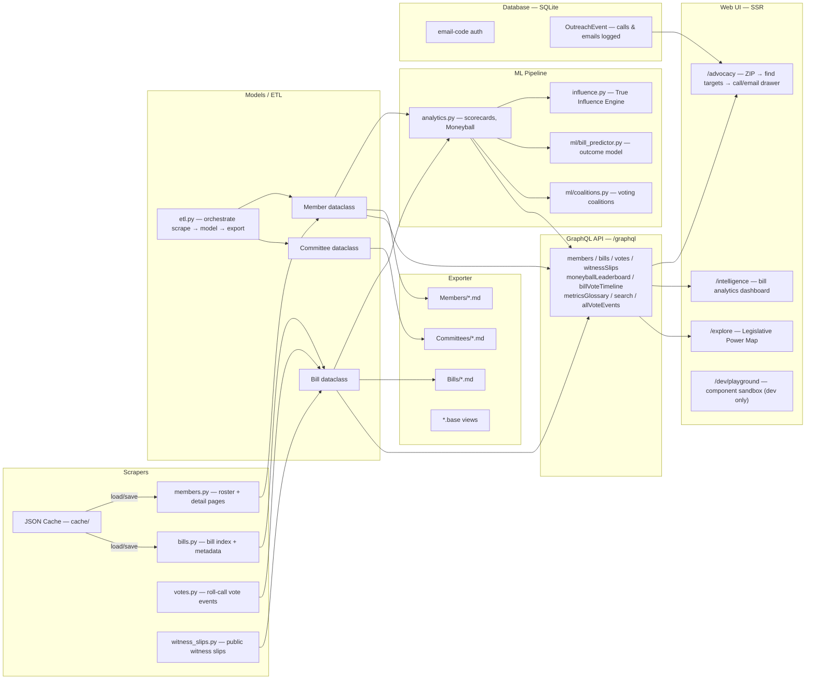

# The Land of Kei — ILGA Graph

A full-stack web application that helps Illinois residents advocate for a statutory fix so highway-capable Kei vehicles can be titled and registered (625 ILCS 5/3-401(c-1)). Enter a ZIP code to find your senator, representative, and a high-impact power broker — then call or email them using a pre-written script in under a minute.

Behind the scenes the app scrapes the [Illinois General Assembly](https://www.ilga.gov/) website, models legislative data (members, committees, bills, votes, witness slips), runs an ML analytics pipeline, and exposes everything through a GraphQL API. It also exports an interlinked [Obsidian](https://obsidian.md/) vault for offline research.

## Architecture Overview


```mermaid
flowchart LR
    subgraph scraping [Scrapers]
        Cache["JSON Cache — cache/"]
        FetchMembers["members.py — roster + detail pages"]
        FetchBills["bills.py — bill index + metadata"]
        FetchVotes["votes.py — roll-call vote events"]
        FetchSlips["witness_slips.py — public witness slips"]
    end
    subgraph models [Models / ETL]
        Member["Member dataclass"]
        Committee["Committee dataclass"]
        Bill["Bill dataclass"]
        ETL["etl.py — orchestrate scrape → model → export"]
    end
    subgraph ml [ML Pipeline]
        Analytics["analytics.py — scorecards, Moneyball"]
        Influence["influence.py — True Influence Engine"]
        Predictions["ml/bill_predictor.py — outcome model"]
        Coalitions["ml/coalitions.py — voting coalitions"]
    end
    subgraph export [Exporter]
        MemberMD["Members/*.md"]
        CommitteeMD["Committees/*.md"]
        BillMD["Bills/*.md"]
        BaseFiles["*.base views"]
    end
    subgraph webui [Web UI — SSR]
        Advocacy["/advocacy — ZIP → find targets → call/email drawer"]
        Intelligence["/intelligence — bill analytics dashboard"]
        Explore["/explore — Legislative Power Map"]
        DevPlayground["/dev/playground — component sandbox (dev only)"]
    end
    subgraph api [GraphQL API — /graphql]
        GQLQuery["members / bills / votes / witnessSlips\nmoneyballLeaderboard / billVoteTimeline\nmetricsGlossary / search / allVoteEvents"]
    end
    subgraph db [Database — SQLite]
        Auth["email-code auth"]
        Outreach["OutreachEvent — calls & emails logged"]
    end
    Cache -->|"load/save"| FetchMembers
    Cache -->|"load/save"| FetchBills
    FetchMembers --> Member
    FetchBills --> Bill
    FetchVotes --> Bill
    FetchSlips --> Bill
    ETL --> Member
    ETL --> Committee
    Member --> Analytics
    Bill --> Analytics
    Analytics --> Influence
    Analytics --> Predictions
    Analytics --> Coalitions
    Member --> MemberMD
    Committee --> CommitteeMD
    Bill --> BillMD
    Member --> GQLQuery
    Bill --> GQLQuery
    Analytics --> GQLQuery
    GQLQuery --> Advocacy
    GQLQuery --> Intelligence
    GQLQuery --> Explore
    db --> Outreach
    Outreach --> Advocacy
```

## Data Flow

1. **Startup** -- The FastAPI app boots; `lifespan()` in `startup.py` runs `run_etl()` then `init_db()`.
2. **Scrape** -- Scrapers in `src/ilga_graph/scrapers/` hit `ilga.gov` to pull members, bills, committee rosters, roll-call votes, and witness slips. Requests are parallelized with `ThreadPoolExecutor`. Results are cached as JSON in `cache/` so repeat runs skip the network.
3. **Model** -- Raw HTML is parsed (BeautifulSoup) into Python dataclasses: `Member`, `Committee`, `Bill`, `Office`, `CareerRange`, and `CommitteeMemberRole`.
4. **ML Analytics** -- `analytics.py` computes legislative scorecards and Moneyball profiles. The `ml/` sub-package runs bill-outcome predictions, coalition detection, and graph embeddings. Results are stored in `processed/` as Parquet files and cached in memory.
5. **Export** -- `ObsidianExporter` writes each member, committee, and bill as a Markdown file inside `ILGA_Graph_Vault/`. Files use Obsidian `[[wikilinks]]` so members link to their committees and bills, committees link to their members and bills, and bills link to their sponsors. Frontmatter tags power Obsidian's graph view. The exporter also generates `.base` database view files for sortable/filterable tables.
6. **Serve** -- The same in-memory data is exposed through a Strawberry GraphQL API at `/graphql` and through server-side-rendered HTML pages powered by Jinja2 and HTMX.

## Web Application

The app serves several user-facing pages in addition to the GraphQL API:

| Route | Description |
|-------|-------------|
| `/` (redirects to `/advocacy`) | Landing page |
| `/advocacy` | **Advocacy tool** — enter a ZIP code to find your senator, representative, and a high-impact power broker. Opens a call or email drawer with a pre-written script. Tracks outreach actions in the database (requires sign-in). |
| `/intelligence` | **Intelligence dashboard** — bill analytics, win-probability predictions, voting coalitions, witness slip heat, True Influence scores, and anomaly detection. |
| `/intelligence/member/<name>` | Deep-dive page for a single legislator (full scorecard, Moneyball profile, vote history). |
| `/intelligence/bill/<number>` | Deep-dive page for a single bill (timeline, vote events, witness slips). |
| `/explore` | **Legislative Power Map** — interactive visualization of member influence and network relationships. |
| `/graphql` | Strawberry GraphQL playground + API endpoint. |
| `/report-bug` | In-app bug report form (stores to DB; optional email via SMTP). |
| `/privacy`, `/terms` | Legal pages. |
| `/dev/playground` | Component sandbox — call/email drawer, truck animation, etc. (dev mode only). |

## Project Structure

```
ilga-graph/
├── src/ilga_graph/
│   ├── main.py               # FastAPI app, GraphQL mount, static files, error handlers
│   ├── startup.py            # Lifespan hook: ETL → DB init → startup banner
│   ├── etl.py                # run_etl() — orchestrates scrape → model → export
│   ├── app_state.py          # AppState singleton holding in-memory members/bills/committees
│   ├── config.py             # All env-var settings (profile system: dev / prod)
│   ├── constants.py          # CATEGORY_CHOICES, CATEGORY_COMMITTEES, etc.
│   ├── models.py             # Dataclass domain models (Member, Bill, Committee, …)
│   ├── schema.py             # Strawberry GraphQL types + sort/filter enums
│   ├── graphql_query.py      # GraphQL Query resolvers (members, bills, votes, search, …)
│   ├── loaders.py            # DataLoader factories for batched GraphQL queries
│   ├── scraper.py            # Legacy ILGAScraper shim (delegates to scrapers/)
│   ├── scrapers/             # Modular scrapers
│   │   ├── bills.py          #   Bill index + metadata
│   │   ├── votes.py          #   Roll-call vote events
│   │   ├── witness_slips.py  #   Public witness slips
│   │   └── full_text.py      #   Full bill text PDFs
│   ├── exporter.py           # ObsidianExporter — Markdown vault + Bases generator
│   ├── analytics.py          # Legislative scorecards, Moneyball v2
│   ├── analytics_cache.py    # Persist analytics results to processed/
│   ├── moneyball.py          # Moneyball composite score computation
│   ├── influence.py          # True Influence Engine (eigenvector centrality + heuristics)
│   ├── vote_timeline.py      # Bill vote timeline computation
│   ├── voting_record.py      # Member vote history helpers
│   ├── metrics_definitions.py # Definitions exposed via metricsGlossary GraphQL query
│   ├── ml/                   # ML pipeline
│   │   ├── bill_predictor.py #   Bill outcome prediction (XGBoost)
│   │   ├── coalitions.py     #   Voting coalition detection
│   │   ├── node_embedder.py  #   Node2Vec co-sponsorship graph embeddings
│   │   ├── anomaly_detection.py # Outlier scoring
│   │   ├── features.py       #   Feature engineering
│   │   ├── rule_engine.py    #   Bill-to-law process rules
│   │   └── …                 #   (active_learner, backtester, explainer, …)
│   ├── routers/              # FastAPI route groups
│   │   ├── advocacy.py       #   /advocacy — landing, search, drawer
│   │   ├── intelligence.py   #   /intelligence — dashboard + deep-dives
│   │   ├── explore.py        #   /explore — Legislative Power Map
│   │   ├── bills.py          #   /bills — bill SHAP / analytics endpoints
│   │   ├── outreach.py       #   /outreach — stats aggregation
│   │   ├── auth.py           #   /auth — email-code sign-in
│   │   ├── feedback.py       #   /report-bug
│   │   ├── dev.py            #   /dev — playground (dev only)
│   │   ├── admin.py          #   /logs, /health, /api/dev/members
│   │   ├── legal.py          #   /privacy, /terms
│   │   └── site.py           #   /, sitemap, robots, favicon, 404 catch-all
│   ├── db.py                 # Async SQLite engine + session factory (aiosqlite)
│   ├── db_models.py          # SQLAlchemy ORM models (User, OutreachEvent, BugReport, …)
│   ├── security.py           # CSRF, rate limiting, photo URL validation
│   ├── middleware.py         # CORS, API key, request logging, CSRF, HSTS, CSP
│   ├── dependencies.py       # FastAPI dependency injection helpers
│   ├── advocacy_helpers.py   # Shared advocacy logic (find targets, drawer context)
│   ├── member_lookup.py      # find_member_by_district(), find_member_by_id(), …
│   ├── intelligence_helpers.py # Canonical org names, bill description helpers
│   ├── search.py             # Cross-entity search (members + bills + committees)
│   ├── seating.py            # Chamber seating / district helpers
│   ├── zip_crosswalk.py      # ZIP → district mapping
│   ├── date_parse.py         # Date parsing utilities
│   ├── normalize.py          # Name / text normalization
│   ├── data_source.py        # Detect mock vs real cache
│   ├── startup_banner.py     # Startup timing banner printed to stderr
│   ├── run_log.py            # .run_log.jsonl append helpers
│   ├── templates/            # Jinja2 HTML templates
│   └── static/               # CSS, images, advocacy PDFs
├── scripts/                  # CLI utilities (scrape, ml_run, snapshot_mocks, …)
├── mocks/dev/                # Committed seed data (20 members, 100 bills, …)
├── tests/                    # pytest test suite
├── graphql/                  # Example GraphQL queries + README
├── docs/                     # MkDocs documentation site
├── processed/                # ML output Parquet files (auto-created, git-ignored)
├── ILGA_Graph_Vault/         # Generated Obsidian vault (output)
├── cache/                    # Scraped JSON cache (auto-created, git-ignored)
├── data/                     # SQLite DB files (auto-created, git-ignored)
├── Makefile                  # Dev workflow commands
├── PERFORMANCE.md            # Performance notes and bottleneck analysis
├── TODOS.md                  # Project roadmap and completed items
├── pyproject.toml
└── README.md
```

## Module Breakdown

### `models.py`

Plain Python dataclasses that form the domain model:

| Class                 | Purpose                                                |
|-----------------------|--------------------------------------------------------|
| `Member`              | A legislator -- name, party, district, bio, offices, bills, committees |
| `Committee`           | A legislative committee with code, name, and optional parent |
| `Bill`                | A piece of legislation with sponsor, status, and action date |
| `Office`              | A contact office (Springfield or district) with address/phone/fax |
| `CareerRange`         | A year-range entry in a member's career timeline       |
| `CommitteeMemberRole` | Represents a member's role on a specific committee roster |

### `scrapers/`

Modular scrapers, each in its own file:

- **`scrapers/bills.py`** -- Fetches the bill index (paginated), scrapes each bill's metadata page in parallel, and normalizes sponsor names. Supports incremental (new/changed only), full-text, and skip-votes modes.
- **`scrapers/votes.py`** -- Scrapes roll-call vote pages and parses member vote lists (Yea/Nay/Present/NV).
- **`scrapers/witness_slips.py`** -- Fetches public witness slip submissions for each bill and paginates through them.
- **`scrapers/full_text.py`** -- Downloads and caches full bill text PDFs.
- **`scraper.py`** -- Legacy `ILGAScraper` that now delegates to the above modules plus handles member and committee scraping. Maintains a normalized name→ID map and stores a denormalized JSON cache (~70% smaller than embedding full bill objects in each member).

### `exporter.py`

`ObsidianExporter` turns domain models into an interlinked Obsidian vault:

- Generates **YAML frontmatter** for each note, including sortable properties like `last_action_date_iso` (ISO date) on bills and `career_start_year` (integer) on members.
- Renders **`[[wikilinks]]`** between members, committees, and bills so Obsidian's graph view shows the network.
- Creates hierarchical **tags** (`#committee/agriculture`, `#subcommittee/executive/firearms`) for filtering.
- Builds a **Member Index** page listing all legislators with links to their ILGA pages.
- Generates **Obsidian Bases** `.base` files for sortable, filterable database views of bills and members.
- **Legislative scorecard** — Each member note includes a scorecard that separates substantive bills (HB/SB) from ceremonial resolutions (HR/SR/HJR/SJR), and computes *law heat*, *law success rate*, *magnet score* (avg co-sponsors per law), and *bridge score* (% of laws with cross-party co-sponsorship). A **Scorecard Guide** in the vault explains each metric and how to interpret the numbers; see `ILGA_Graph_Vault/Scorecard Guide.md`.
- Cleans up stale `.md` files on re-export so the vault stays in sync.

### `analytics.py` / `moneyball.py` / `influence.py`

Analytics layer that runs after loading:

- **`analytics.py`** -- Computes `ScorecardStats` (substantive vs. ceremonial bill counts, passage rate, co-sponsor metrics) and `MoneyballProfile` for every member. Results are cached to `processed/` as Parquet via `analytics_cache.py`.
- **`moneyball.py`** -- Computes the 0–100 Moneyball composite score used to rank legislators (passage rate + pipeline depth + co-sponsor pull + cross-party rate + network centrality + institutional role bonus). Exact weights and definitions are in `metrics_definitions.py` and exposed via the `metricsGlossary` GraphQL query.
- **`influence.py`** -- True Influence Engine: eigenvector centrality over the co-sponsorship graph, blended with Moneyball and institutional role to produce a final influence rank.

### `ml/`

Optional ML pipeline (install with `pip install -e ".[ml]"` or `make ml-setup`):

| Module | Purpose |
|--------|---------|
| `bill_predictor.py` | XGBoost model predicting bill outcome (pass / fail / stall) |
| `coalitions.py` | Voting coalition detection via clustering |
| `node_embedder.py` | Node2Vec graph embeddings over the co-sponsorship network |
| `anomaly_detection.py` | Outlier scoring for unusual voting patterns |
| `features.py` | Feature engineering from bill/member dataclasses |
| `rule_engine.py` | Deterministic bill-to-law process rules (committee → floor path) |
| `action_classifier.py` | Classify bill actions into pipeline stages (0–6) |
| `explainer.py` | SHAP-based explanations for model predictions |

Run the full pipeline with `make ml-run` or trigger it automatically via `make scrape`.

### `schema.py` / `graphql_query.py`

`schema.py` contains Strawberry GraphQL type definitions and enums. `graphql_query.py` holds the `Query` class with all resolvers:

| Type / Enum            | Purpose                                                  |
|------------------------|----------------------------------------------------------|
| `BillType`             | GraphQL type mirroring the `Bill` dataclass              |
| `MemberType`           | GraphQL type mirroring the `Member` dataclass (includes scorecard + moneyball) |
| `OfficeType`           | GraphQL type for contact offices                         |
| `CareerRangeType`      | GraphQL type for career timeline entries                 |
| `ScorecardType`        | GraphQL type for legislative scorecard metrics           |
| `MoneyballProfileType` | GraphQL type for Moneyball analytics profile             |
| `VoteEventType`        | GraphQL type for roll-call vote events                   |
| `BillVoteTimelineType` | Full vote lifecycle analytics for a bill in one chamber  |
| `BillSortField`        | Enum: `LAST_ACTION_DATE`, `BILL_NUMBER`                  |
| `MemberSortField`      | Enum: `CAREER_START`, `NAME` -- base member sorts        |
| `LeaderboardSortField` | Enum: `MONEYBALL_SCORE`, `EFFECTIVENESS_SCORE`, `PIPELINE_DEPTH`, etc. -- analytics sorts |
| `SortOrder`            | Enum: `ASC`, `DESC`                                      |

### `db.py` / `db_models.py`

Async SQLite database (SQLAlchemy + aiosqlite, migrations via Alembic):

| ORM Model | Purpose |
|-----------|---------|
| `User` | Authenticated user (email + verified flag) |
| `OutreachEvent` | One call or email to a legislator (user + member + type + timestamp) |
| `BugReport` | In-app bug reports submitted via `/report-bug` |

The `dev` profile uses `data/ilga_dev.db` (seeded with mock outreach data); `prod` uses `data/ilga.db`.

### `routers/`

FastAPI route groups — each file owns one feature area:

| Router | Mount | Description |
|--------|-------|-------------|
| `site.py` | `/` | Landing redirect, sitemap, robots.txt, favicon, 404 catch-all |
| `advocacy.py` | `/advocacy` | ZIP search, target finder, call/email drawer, outreach recording |
| `intelligence.py` | `/intelligence` | Analytics dashboard, member/bill deep-dives |
| `explore.py` | `/explore` | Legislative Power Map |
| `bills.py` | `/bills` | SHAP / bill analytics endpoints |
| `outreach.py` | `/outreach` | Aggregated outreach stats |
| `auth.py` | `/auth` | Email-code sign-in / sign-out |
| `feedback.py` | `/report-bug` | In-app bug report form |
| `dev.py` | `/dev` | Component playground (dev only) |
| `admin.py` | `/logs`, `/health` | Run log viewer, health check, dev members endpoint |
| `legal.py` | `/privacy`, `/terms` | Legal pages |

### `main.py`

Thin entry point (~270 lines): creates the FastAPI app, mounts the GraphQL router, registers all sub-routers, sets up Jinja2 and static file serving, and attaches global exception handlers (HTTPException → HTML/JSON, unhandled → 500 page).

### Metrics: empirical vs derived

We show **empirical** stats first (directly from bill/member data): laws filed, laws passed, passage rate, vetoed, stuck, cross-party co-sponsorship %, pipeline depth (0–6), etc. **Derived** metrics are explained so they are not a black box:

- **Moneyball score** — A 0–100 composite used to rank legislators (e.g. for Power Broker). It combines passage rate, pipeline depth, co-sponsor pull, cross-party rate, network centrality, and institutional role. Exact weights and one-sentence definitions for each component are in `metrics_definitions.py` and exposed via the GraphQL query `metricsGlossary`.
- **Effectiveness** — We prefer showing *laws passed* and *passage rate* separately; the legacy "effectiveness score" (volume × rate) is documented in the glossary for transparency.

The advocacy UI shows "Laws passed (X of Y — Z% passage)" and "Cross-party co-sponsorship %" before the Moneyball composite, with a tooltip that explains the composite. Use `metricsGlossary` in your client to build tooltips or a "How is this calculated?" panel.

## Obsidian Vault Features

### Frontmatter Properties

Each note type includes structured YAML frontmatter enabling Obsidian search, Bases views, and graph filtering:

**Bills** -- `leg_id`, `bill_number`, `chamber`, `status`, `last_action_date`, `last_action_date_iso` (YYYY-MM-DD for sorting), `tags`

**Members** -- `chamber`, `party`, `role`, `career_timeline`, `career_start_year` (integer for sorting), `district`, `member_url`, `tags`

**Committees** -- `code`, `parent_code`, `tags`

### Bases Database Views

The vault includes two Obsidian Bases (`.base`) files, generated by the exporter:

- **Bills by Date** -- Two table views: "Bills by Date" (all bills grouped by date, newest first) and "Recent Bills" (filtered to 2025+).
- **Members by Career** -- Table view of all members grouped by career start year (earliest first), with chamber, party, role, and name columns.

These views are interactive in Obsidian -- click column headers to re-sort, use the Bases UI to adjust filters.

### Graph View

The graph is configured with color groups:
- **Red** -- Republicans (`tag:#party/republican`)
- **Blue** -- Democrats (`tag:#party/democrat`)

## Getting Started

### Prerequisites

- Python 3.10+

### Install

```bash
make install        # pip install -e ".[dev]"
```

Or manually:

```bash
pip install -e ".[dev]"
```

**Pre-commit (recommended):** To enforce line length (100 chars) and formatting on every commit, install the git hooks once:

```bash
pre-commit install
```

Then Ruff (check + format) runs automatically on commit. To check the whole repo without committing: `make pre-commit`.

### Pipeline: scrape → serve

Data is scraped once into `cache/`; the API then **serves only from cache** (no scraping on startup).

| Step | Command | What it does |
|------|---------|--------------|
| **Scrape** | `make scrape` | Smart/tiered: full walk if no cache or >7 days old; else tail-only. Scrapes members + bills + votes + slips, then runs the ML pipeline. |
| | `make scrape FULL=1` | Force a full bill index walk (all ~125 pages), then scrape. Use for a new session or "refresh all." |
| | `make scrape-full` | Nuke cache + full index (`FRESH=1 FULL=1`). Use when members or data look wrong. |
| | `make scrape-full-members` | Re-fetch the full member roster from ILGA (~177). Keeps existing bills cache. |
| **Serve** | `make dev` | Start app in dev mode (auto-reload, seed fallback, DEV_MODE=1). |
| | `make serve` | Start app in prod mode (`ILGA_PROFILE=prod`). |

**Typical flows:**

- **Quick dev (no network):** `make dev` — uses `mocks/dev/` seed data automatically (no scrape needed).
- **Real data, fast iteration:** `make scrape` then `make dev` — fresh cache, hot reload.
- **Production deploy:** `make scrape` then `make serve`.

If you run `make dev` with no cache, the server falls back to `mocks/dev/` automatically.

### ML Pipeline

```bash
make ml-setup       # pip install -e ".[ml]" — install ML extras
make ml-run         # full pipeline: cache → parquet → scores → predictions
make ml-pipeline    # data pipeline only: cache/*.json → processed/*.parquet
make ml-predict     # bill outcome prediction only
make ml-embed       # Node2Vec graph embeddings (co-sponsorship network)
make ml-resolve     # entity resolution (interactive; AUTO=1 for no prompts)
```

`make scrape` automatically runs the ML pipeline after scraping.

### Other commands

```bash
make snapshot-mocks    # sample cache/ into mocks/dev/ (commit to refresh seed)
make smoke-outreach    # smoke test: auth + record call/email (no server needed)
make logs              # terminal run-log dashboard (last 20 entries)
make export            # re-export Obsidian vault from cache (no scrape)
make test              # pytest
make lint              # ruff check + format check
make lint-fix          # auto-fix
make pre-commit        # run pre-commit on all files (ruff + pytest; same as hook)
make clean             # remove cache/, processed/ parquet, and vault files
```

**Before opening a PR:** run `make lint` and `make test` (or `make pre-commit` if you use the hooks).

### Documentation site

The project includes a **MkDocs Material** doc site in `docs/` (user guides, development internals, and pipeline testing).

| Command | What it does |
|---------|----------------|
| `make docs` | Build the site to `site/` (static HTML). |
| `make docs-serve` | Serve the docs at **http://127.0.0.1:8001** (port 8001 so it doesn’t clash with `make dev` on 8000). |

Install doc dependencies first: `pip install -e ".[docs]"` (or add `docs` to your install, e.g. `pip install -e ".[dev,docs]"`). Then run `make docs-serve` and open the URL above. The site includes:

- **User guide:** Advocacy Test Mode — how to skip the normal flow and jump to the call script or email drawer.
- **Development:** Advocacy Test Mode internals (URL contract, routes, templates, auto-open behavior) and bills-first pipeline testing.

### Environment Variables

Copy [`.env.example`](.env.example) to `.env` in the project root. The app loads it via `python-dotenv`.

#### Quick start (zero config)

The default profile is `dev` — just run `make dev` and everything works.

#### Production

```bash
ILGA_PROFILE=prod
ILGA_CORS_ORIGINS=https://landofkei.org
ILGA_API_KEY=your-secret-key
```

That's it. The `prod` profile sets `DEV_MODE=0`, `SEED_MODE=0`, and warns at startup if CORS or API_KEY are missing.

#### Full reference

`ILGA_PROFILE` sets sensible defaults for each environment. Any individual variable overrides the profile value.

| Profile | `DEV_MODE` | `SEED_MODE` | `CORS_ORIGINS` | `MEMBER_LIMIT` |
|---------|-----------|-------------|----------------|----------------|
| `dev`   | `1`       | `1`         | `*`            | `0` (→ 20)     |
| `prod`  | `0`       | `0`         | *(must set)*   | `0` (all)      |

All variables:

| Variable | Default | Description |
|----------|---------|-------------|
| **`ILGA_PROFILE`** | `dev` | `dev` or `prod`. Sets defaults for the flags below. |
| `ILGA_GA_ID` | `18` | General Assembly ID (104th GA). |
| `ILGA_SESSION_ID` | `114` | Session ID. |
| `ILGA_BASE_URL` | `https://www.ilga.gov/` | ILGA site base URL. |
| `ILGA_APP_BASE_URL` | `http://127.0.0.1:8000` | Public URL of this app (startup banner, sitemap, OG cards). |
| `ILGA_SITE_NAME` | `The Land of Kei` | Site name shown in page titles and footer. |
| `ILGA_CACHE_DIR` | `cache` | Directory for scraped JSON cache. |
| `ILGA_MOCK_DIR` | `mocks/dev` | Seed/mock data directory. |
| `ILGA_DB_PATH` | *profile* | SQLite DB path (`data/ilga_dev.db` dev, `data/ilga.db` prod). |
| `ILGA_DEV_MODE` | *profile* | `1` = lighter scrape, faster delays, dev UI hints; `0` = production. |
| `ILGA_SEED_MODE` | *profile* | `1` = use seed when cache missing; `0` = require cache or live scrape. |
| `ILGA_INCREMENTAL` | `0` | `1` = incremental bill scrape (new/changed only). |
| `ILGA_LOAD_ONLY` | `0` | When `1`, API only loads from cache (no scrape on startup). `make dev` and `make serve` set this. |
| `ILGA_MEMBER_LIMIT` | `0` | Max members per chamber (0 = all). |
| `ILGA_CORS_ORIGINS` | *profile* | Comma-separated CORS origins. |
| `ILGA_API_KEY` | *(empty)* | If set, non-exempt routes require `X-API-Key` header. |
| `ILGA_CSP_ENFORCE` | `0` | `1` = enforce Content-Security-Policy (default: report-only). |
| `ILGA_HSTS_ENABLED` | `0` | `1` = add `Strict-Transport-Security` header (HTTPS only). |
| `ILGA_BETA_BANNER` | `0` | `1` = show site-wide beta banner. |
| `ILGA_TURNSTILE_SITE_KEY` | *(empty)* | Cloudflare Turnstile site key (optional; enables CAPTCHA on bug report form). |
| `ILGA_TURNSTILE_SECRET_KEY` | *(empty)* | Cloudflare Turnstile secret key. |
| `ILGA_UMAMI_WEBSITE_ID` | *(empty)* | Umami analytics website ID (injected in prod when set). |
| `ILGA_VOTE_BILL_URLS` | *(built-in list)* | Comma-separated bill status URLs for votes/slips. |

## Migration: Normalized Cache (v2)

If you have an existing `data/` directory from an older version, rename it to use the new cache path: `mv data cache`.

If you are upgrading from the old denormalized cache (which used `cache/senate_members.json` and `cache/house_members.json` with embedded bill objects), you need to rebuild your cache:

```bash
make clean && make scrape
```

The new format stores members and bills in separate files (`cache/members.json` + `cache/bills.json`), reducing cache size by ~70%. The legacy per-chamber files are still supported as a fallback but will not be generated going forward.

## Performance Monitoring

The application logs detailed timing for each startup step:

```
✓ Data loaded: 20 members, 149 committees (0.23s)
✓ Analytics computed: 20 scorecards, 20 profiles (1.12s)
✓ Vault exported (2.34s)
✓ Roll-call votes scraped: 9 events for 3 bills (3.45s)
━━━━━━━━━━━━━━━━━━━━━━━━━━━━━━━━━━━━━━━━━━━━━━━━━━━━━━━━━━━━━━━━━━━━━━━━━━━━━━
🚀 Application startup complete in 7.14s (load: 0.23s, analytics: 1.12s, export: 2.34s, votes: 3.45s)
━━━━━━━━━━━━━━━━━━━━━━━━━━━━━━━━━━━━━━━━━━━━━━━━━━━━━━━━━━━━━━━━━━━━━━━━━━━━━━
```

All startup timings are logged to `.startup_timings.csv` for historical tracking. See [PERFORMANCE.md](PERFORMANCE.md) for bottleneck analysis and optimization opportunities.

**View timing history:**

```bash
cat .startup_timings.csv           # All startup logs
tail -10 .startup_timings.csv      # Last 10 startups
```

### Example GraphQL Queries

**Recommended: bill + votes + witness slips** — Use the `BillWithVotesAndSlips` query in [`graphql/bill_with_votes_and_slips.graphql`](graphql/bill_with_votes_and_slips.graphql) with variables `{ "billNumber": "HB0034" }`. Note: `votes(billNumber)` returns a **list**; `witnessSlips(billNumber, limit, offset)` returns a **connection** (items + pageInfo). See [`graphql/README.md`](graphql/README.md) for details and other query files.

Look up a single member:

```graphql
{
  member(name: "Neil Anderson") {
    name
    party
    district
    chamber
    committees
    offices {
      name
      address
      phone
    }
    careerRanges {
      startYear
      endYear
      chamber
    }
  }
}
```

List bills sorted by date with a date range filter:

```graphql
{
  bills(sortBy: LAST_ACTION_DATE, sortOrder: DESC, dateFrom: "2025-06-01", dateTo: "2025-12-31") {
    billNumber
    lastActionDate
    description
    primarySponsor
    chamber
  }
}
```

List members sorted by career start:

```graphql
{
  members(sortBy: CAREER_START, sortOrder: ASC) {
    name
    careerTimelineText
    careerRanges {
      startYear
      endYear
    }
  }
}
```

## Tech Stack

| Layer              | Technology                                         |
|--------------------|----------------------------------------------------|
| Web Framework      | `FastAPI`                                          |
| GraphQL            | `Strawberry GraphQL`                               |
| Templating         | `Jinja2` (SSR HTML pages)                         |
| Frontend           | `HTMX` (dynamic partials, no build step)           |
| Web Scraping       | `requests` + `beautifulsoup4`                      |
| Concurrency        | `concurrent.futures.ThreadPoolExecutor`            |
| Data Models        | Python `dataclasses`                               |
| Validation         | `pydantic`                                         |
| Database           | `SQLite` via `SQLAlchemy` async + `aiosqlite`       |
| Migrations         | `Alembic`                                          |
| ML                 | `XGBoost`, `scikit-learn`, `node2vec`, `shap`      |
| Data Pipeline      | `pandas` + `pyarrow` (Parquet)                     |
| Export             | Custom Obsidian Markdown + Bases generator         |
| Caching            | JSON files on disk (`cache/`)                      |
| Testing            | `pytest`                                           |
| Linting            | `ruff`                                             |
| Documentation      | `MkDocs Material`                                  |
| Analytics (opt.)   | `Umami` (self-hosted or cloud)                     |
| CAPTCHA (opt.)     | `Cloudflare Turnstile`                             |
