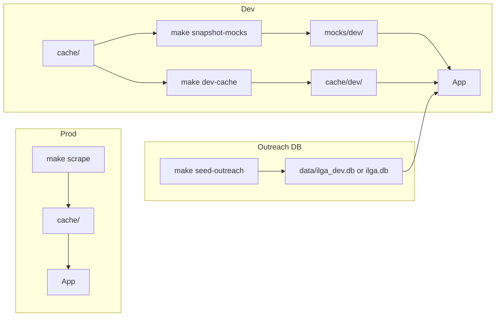

# Data and environments

Where legislative and outreach data come from, and how to refresh them.

---

## One answer per environment

- **Prod:** Legislative data comes from `cache/` only. Scrape writes there; the app reads there. No mocks.
- **Dev:** Legislative data comes from a **single** logical source: if `cache/dev/` has data (e.g. after `make dev-cache`), the app uses it; otherwise it uses `mocks/dev/`.
- **Outreach:** Call/email events live in the SQLite DB (`data/ilga_dev.db` in dev, `data/ilga.db` in prod). Legislative data (members, bills) is separate (cache or mocks). To populate the dev DB with sample outreach, run `make seed-outreach` once (with the same profile as the app).

---

## Data flow

---

## Directories and who uses them

| Directory | Used by | Written by |
|-----------|---------|------------|
| `cache/` | Prod app, scrape script, ML | `make scrape` |
| `cache/dev/` | Dev app (when populated) | `make dev-cache` or manual copy |
| `mocks/dev/` | Dev app (when `cache/dev/` empty) | You (commit) or `make snapshot-mocks` |
| `data/ilga_dev.db` | Dev app (outreach) | App (record call/email), `make seed-outreach` |
| `data/ilga.db` | Prod app (outreach) | App, `make seed-outreach` (backlog) |

---

## Make targets (data-related)

| Target | What it does |
|--------|--------------|
| `make scrape` | Populate `cache/` from ILGA (members, bills, votes, slips). Run with prod profile. |
| `make dev` | Start app in dev mode. Reads from `cache/dev/` if it has `members.json`, else `mocks/dev/`. |
| `make serve` | Start app in prod mode. Reads from `cache/` only. |
| `make dev-reset` | Remove `cache/dev/` so the next `make dev` uses `mocks/dev/`. |
| `make dev-cache` | Copy `cache/` into `cache/dev/` so `make dev` uses full scraped data. Run after `make scrape`. |
| `make snapshot-mocks` | Sample `cache/` into `mocks/dev/` (subset of members, bills, votes, etc.). Commit result to refresh dev seed. |
| `make seed-outreach` | Seed the outreach DB: backlog for funky_mama11@gmail.com; in dev only, mock advocates for heat-pill demo. Use same profile as the app. |

---

## Legislative vs outreach data

- **Legislative data** (members, bills, committees, votes, witness slips, scorecards, moneyball, ZIP→district): comes from **cache or mocks**. Resolution is in one place: `ilga_graph.data_source.get_data_dir()`.
- **Outreach data** (calls, emails, no-answer): stored in **SQLite**. To get sample data in dev, run `make seed-outreach` once with `ILGA_PROFILE=dev`.

See [DB and outreach](db-and-outreach.md) for schema and auth.
